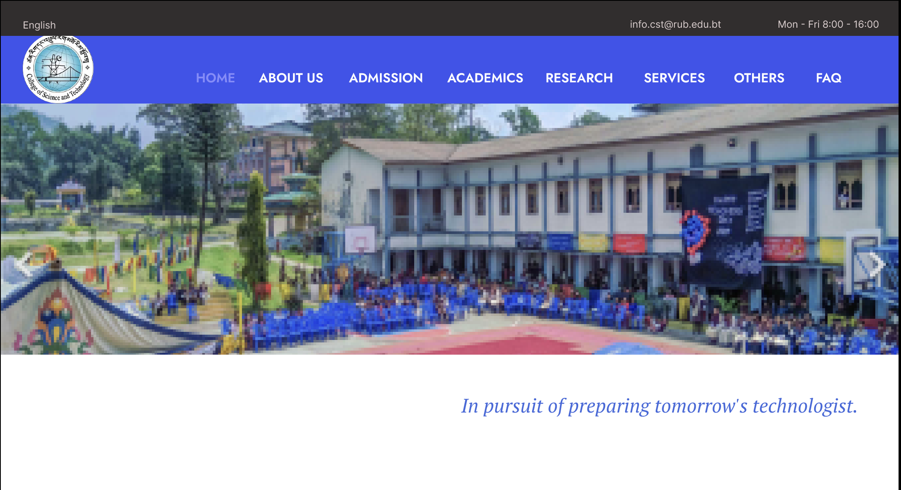
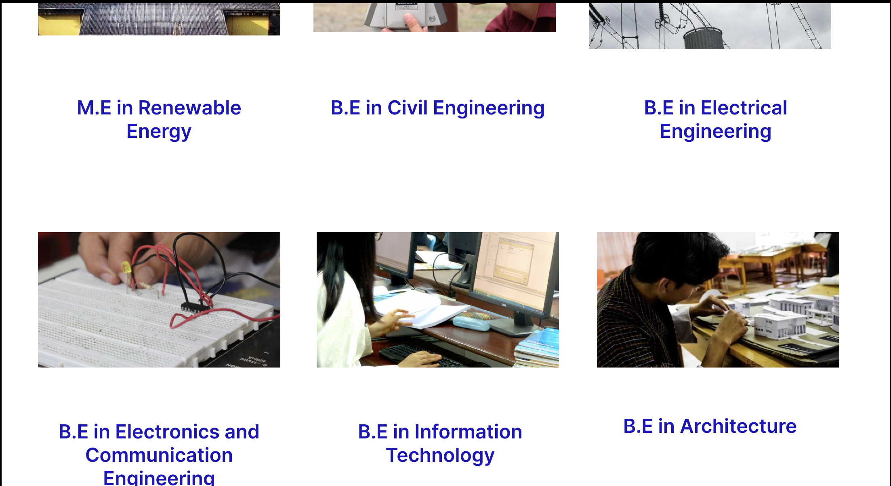
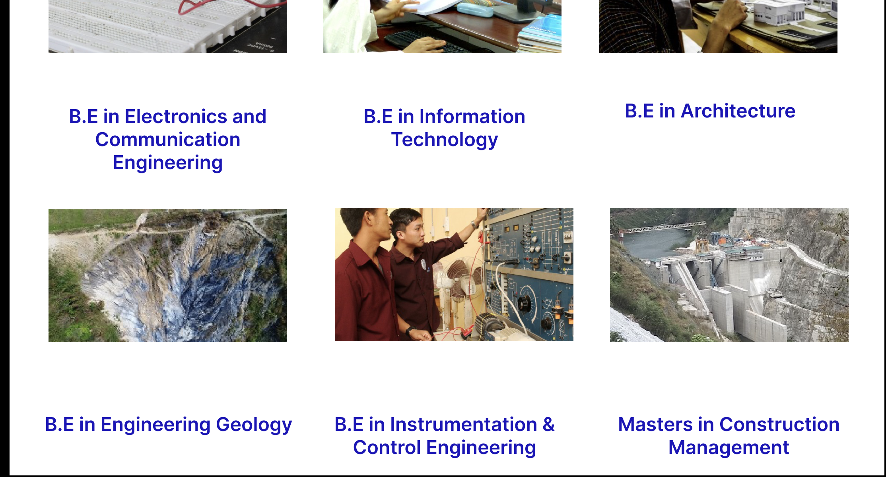
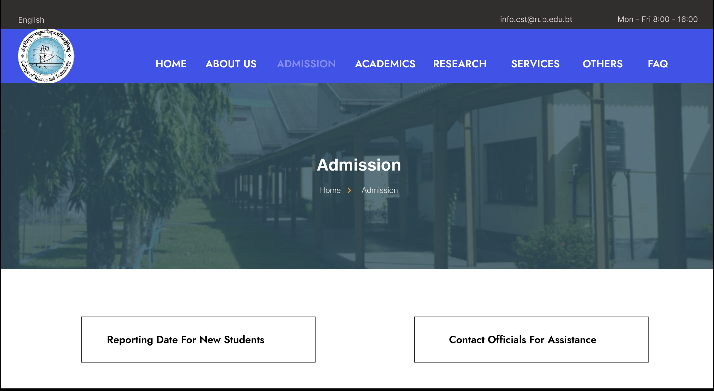
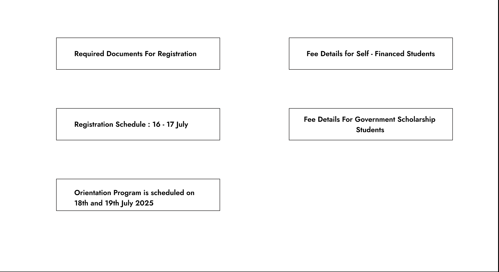

# Replicating Website Design in Figma
This practical exercise involves using Figma to replicate the design of Collge website and a website of your choice(I chose RUB). The goal is to practice using Figma's tools and features to create a functional website layout and learning prototyping, drop-down menus, and other interactive elements.

## 1. College Website Replication

**Link to the original website: [CST](https://www.cst.com/)**

**Link to the Figma file: [CollegeWebsite](https://www.figma.com/design/GhrSg4cYKngkRrFCpuQwII/College-Website?node-id=0-1&t=aGpMge2eZ3cqFfMu-1)**

### Screenshots of the replicated design:

## 2. RUB Website Replication
