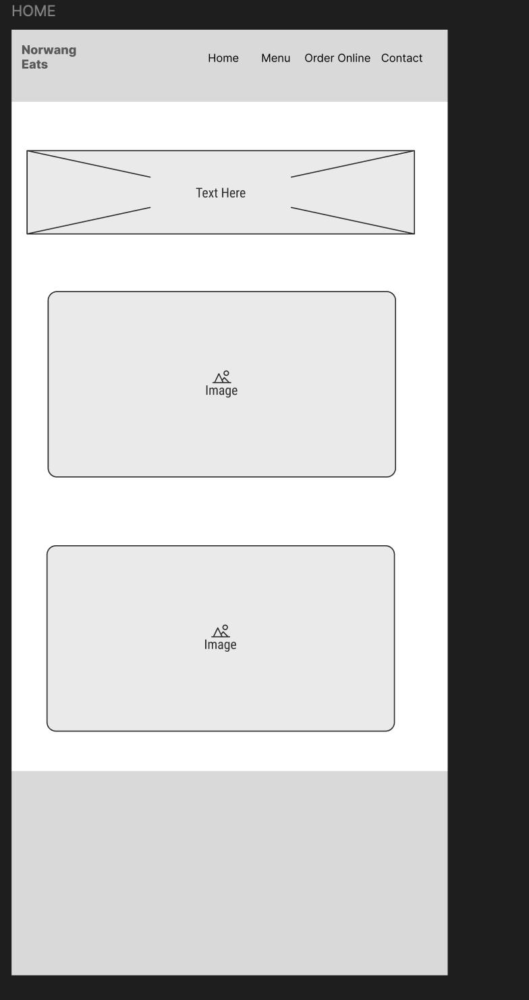
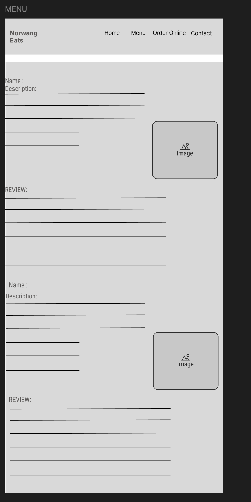
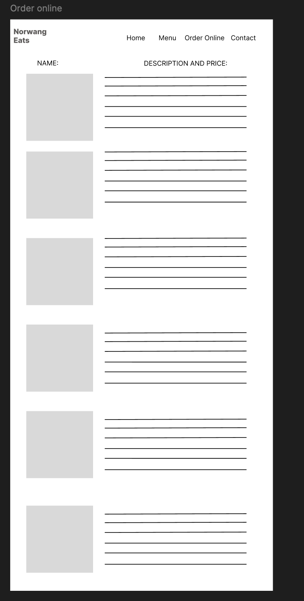
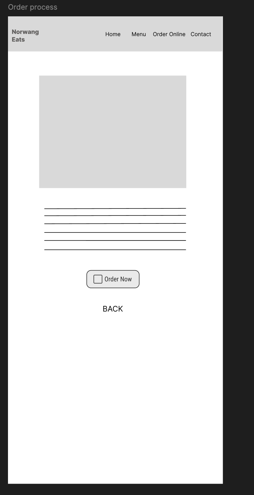
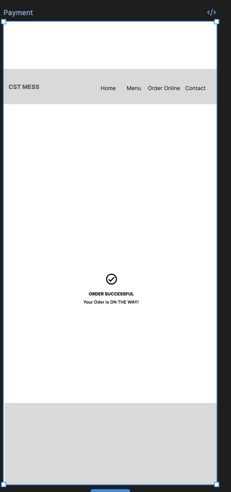
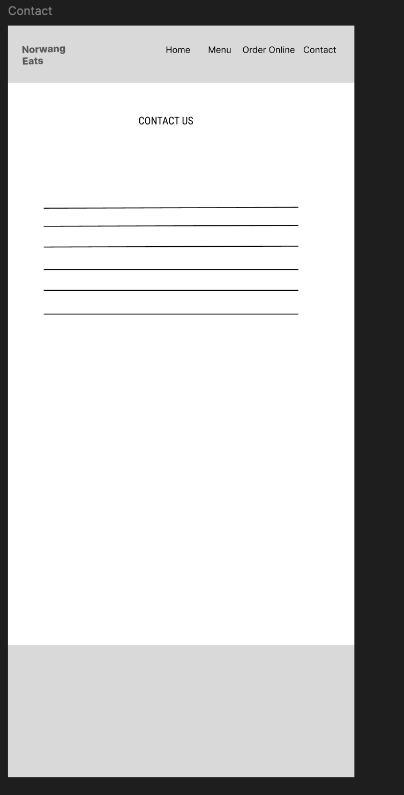

# Wireframe Design in Figma – *Norwang Eats (Food Delivery App)*

This practical exercise involved creating a **low-fidelity wireframe** for a food delivery website named *Norwang Eats*.  
The goal was to understand the structure and flow of a multi-page website using Figma’s design tools.  
Through this, I learned how to organize navigation bars, forms, and buttons, and design a smooth order-to-payment process.

**Link to the Figma file:** [NorwangEatsWireframe](https://www.figma.com/design/s8aMANxTTUFuMxdPAQhhVR/Wireframe?node-id=40-271&t=cwDljuq34NFkEuHF-1)  

---

## Screenshots of the Wireframe Design

### Home Page  

### Menu Page  

### Order Online Page  

### Order Process Page  

### Payment Page  

### Order Successful Page  

### Contact Page  

---

